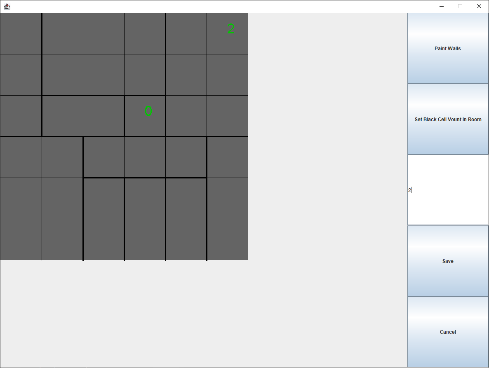
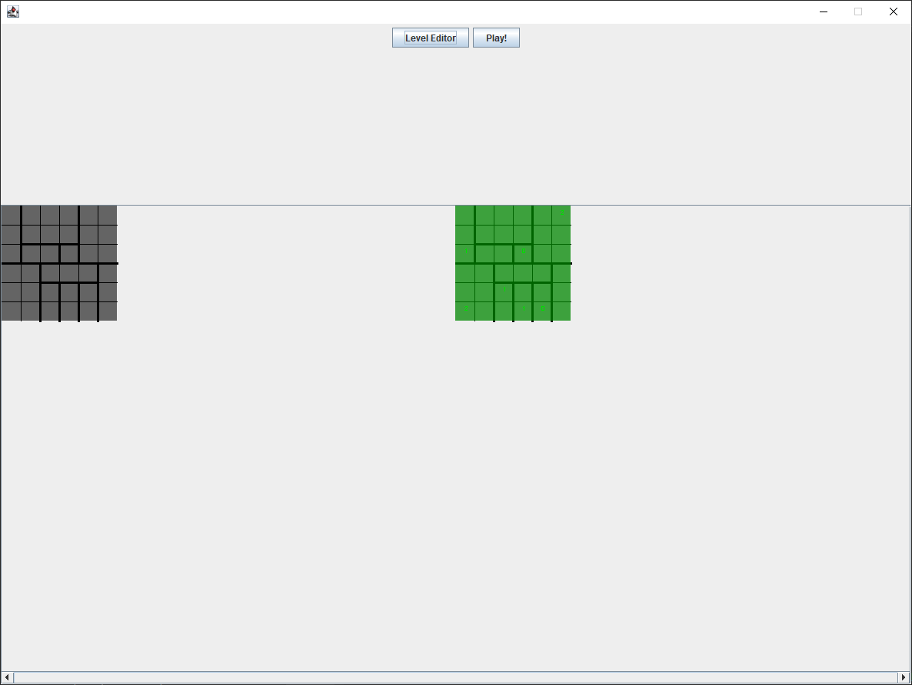
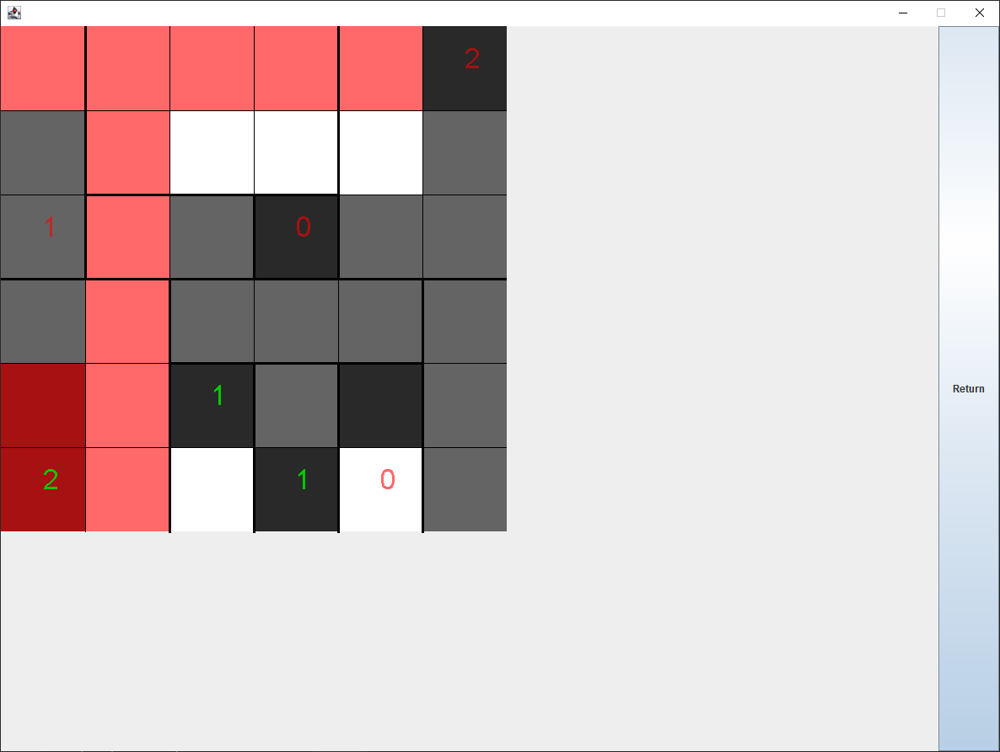
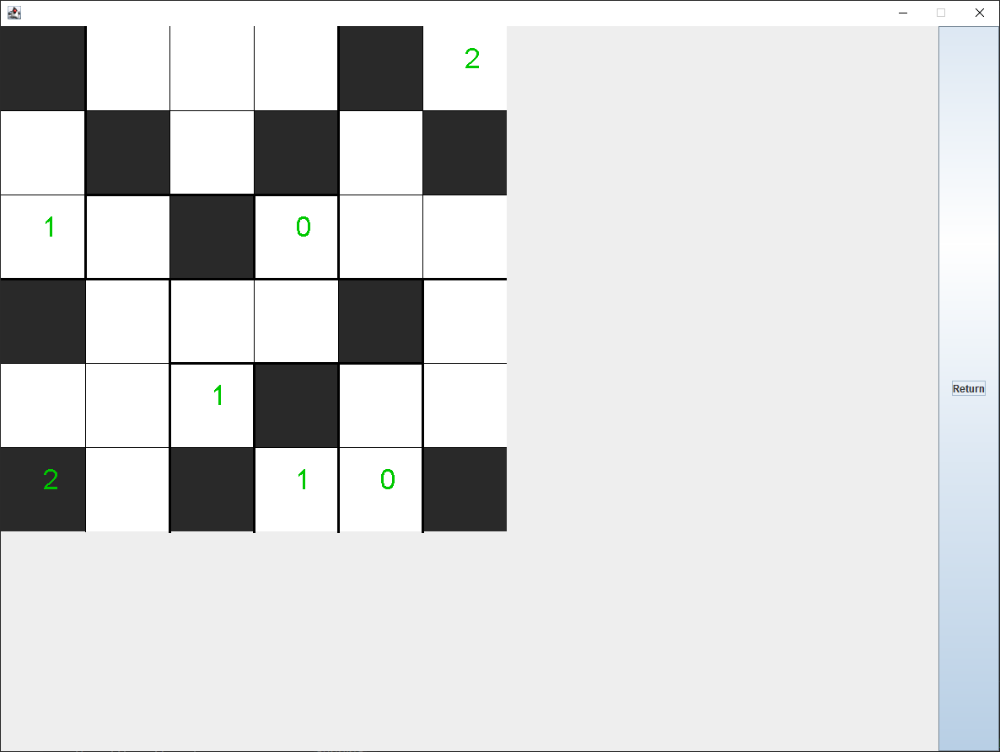

# Heyawake (HeJavaKe..)
### *A 4 day project for sharpening Java skills.*
I had some interesting algorithms in mind, I wanted to try for checking the rules of the Heyawake puzzle. I also have some disgust for checking boundaries of boards, so I came up with an interesting (or maybe overcomplicated) way of representing the game. A graph is used.

An adjacency matrix is used to keep track of edges between neighbouring cells. There are two ways to think about these edges. The first: an edge is a shared side of two table cells. The second: an edge connects two vertices in a graph (in this graph the vertices are the table cells, and there is an edge between them if they share a side).

These edges can represent walls between cells (if there is one). An edge can also tell if its endpoints (the two neighbouring cells) share their colors.

In my representation, only edges between neighbouring cells are used, so a sparse matrix might have been a better choice. 

This data structure made it fairly easy to cone up with ways to check the rules of the game. Iterating over the edges and using lambdas on them resulted fairly nice code. It also made possible to write a very conscise way of the flood fill algorithm.

But most importantly, I didn't need to check boundaries of the board a single time... 

# Some pictures 

Level Editor

Main Menu with Level Selector

The Game with error checking

